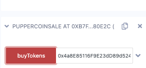

# CrowdSale PupperCoin


In this project, I had to create a crowdsale contract using Solidity for a token called the "PupperCoin". The goal amount for the crowdsale is 300 Ether and will last 24 weeks.

### **Some of the crowdsale contract features are:**
- An ERC20 token will be created and be minted through a Crowdsale contract that can be leveraged from the OpenZeppelin Solidity library.
- This crowdsale contract manages the entire process, allowing users to send ETH and get back PUP (PupperCoin).
- This contract will mint the tokens automatically and distribute them to buyers in one transaction.
The crowdsale contract inherits from ```Crowdsale```, ```CappedCrowdsale```, ```TimedCrowdsale```, ```RefundableCrowdsale```, and ```MintedCrowdsale```.
- The crowdsale will be conducted on the Kovan testnet in order to get a real-world pre-production test in.

```PupperCoin.sol``` file creates a standard ```ERC20Mintable token```. It uses an ERC20Detailed contract.

```Crowdsale.sol``` file takes in the following parameters:

- rate - rate in TKNbits
- wallet - sale beneficiary
- goal - cap of the crowdsale
- openingTime - is set equal to now
- closingTime - is set equal to now + 24 weeks

As stated previously, this contract inherits from the following OpenZeppelin contracts:

 - ```Crowdsale``` - takes in rate, wallet, and token as parameters
 - ```CappedCrowdsale``` - takes in goal as a parameter
 - ```TimedCrowdsale``` - takes in openingTime and closingTime as parameters
 - ```RefundableCrowdsale``` - takes in goal as a parameter
 - ```MintedCrowdsale```

It is important to note that the RefundableCrowdsale constructor is called instead of the RefundablePostDeliveryCrowdsalecontract because RefundablePostDeliveryCrowdsale inherits the RefundableCrowdsale constructor.

### **Testing the Crowdsale**

1. Connect to a test network such as Kovan or Ropsten
2. Fund your account using a test faucet
3. Compile Crowdsale.sol and deploy PupperCoinSaleDeployer from the contract dropdown menu.
4. Under deploy, set name to "puppercoin", symbol as "pup", wallet as the address of your Metamask and goal to 300.


5. Hit Transact and hit confirm on the Metamask popup.
6. Under Deployed Contracts, copy the value given for token_address


7. Select PupperCoin from the contract dropdown menu and paste the token address to At Address field then click the At Address button.
8. Copy the token_sale_address from the PupperCoinSaleDeployer deployed contract and switch the contract to PupperCoinSale then paste the token_sale_address into the AT Address field and click At Address button.
9. Under Deployed Contracts, expand the PupperCoinSale contract and enter an address from Ganache as the beneficiary under buyTokens.


10. Change to desired value and transact.